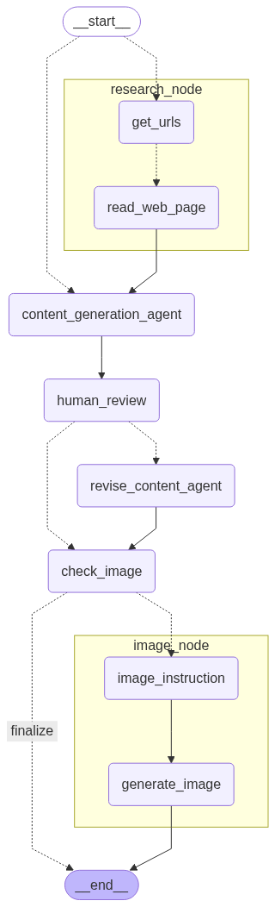

# 🤖 AI Content Creation Workflow


An intelligent, agent-based workflow for generating content and images using automated research, LLMs, and human review. Powered by [LangGraph](https://github.com/langchain-ai/langgraph), this project streamlines the entire content production process—from fetching research data to delivering polished text and visuals.


## 🗺️ Workflow Overview

This workflow includes the following steps:

1. **Research**: Automatically collects and reads web content.
2. **Content Generation**: Generates draft content using a language model.
3. **Human Review**: Optional human validation and feedback.
4. **Revision**: Updates content based on review.
5. **Image Check & Generation**: Determines if an image is needed and generates it.
6. **Finalize**: Ends the workflow and outputs the results.

### 🧩 Visual Diagram

<p align="center">
  
</p>

> The diagram shows the full flow, including loops for revision and image review.

---

## 🚀 Getting Started

### 📦 Installation

```bash
git clone https://github.com/bion-slmn/social_media_agent_langgraph.git
  # or pip install if it's Python-based
````

> ⚠️ Update the above line based on your stack: `npm`, `pip`, or `poetry`.

### 🧪 Run the Workflow

```bash
langgraph dev
```

You can trigger the flow manually or via API integration. See the `/src` directory for agent logic.

---

## 🔧 Folder Structure

```
.
├── src/                          # Main workflow and agent logic
├── docs/assets/                 # Workflow diagram and image samples
├── langgraph.json               # LangGraph configuration
├── README.md
└── ...
```

---

## 🛠️ Built With

* [LangGraph](https://github.com/langchain-ai/langgraph)
* [OpenAI / Local LLMs](https://platform.openai.com/docs/)
* [DALL·E / Image API](https://platform.openai.com/docs/guides/images) *(or other image models)*
* TypeScript / Python backend *(customize this depending on your tech stack)*

---

## ✨ Features

* 🕸 Automated web research using URL agents
* ✍️ LLM-based content generation with revision loop
* 👨‍🔧 Human-in-the-loop review process
* 🖼 Visual generation based on content context
* ⚙️ Flexible, modular, and easy to customize

---

## 📄 License

This project is licensed under the [MIT License](LICENSE).

---

## 🙋‍♀️ Contributing

Pull requests are welcome! For major changes, please open an issue first to discuss what you'd like to change.

---

```
